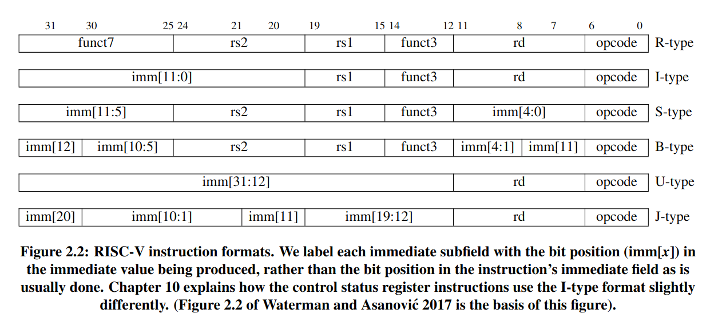

# RISC-V Instruction

In this commit, 6 basic instruction format types are defined as struct. THe base struct *InstructionBase* is empty. And all 6 types are heritaged from it. Correspondingly, the construction function for each type decode the input instruction.

6 types basic instruction formats:

- R-type: register-register operation
- I-type: short immediates and loads operation
- S-type: stores operator
- B-type: conditional branches operation
- U-type: long immediates operation
- J-type: unconditional jumps operation

## The benefit of RV instructions

- Less instruction types

  - RV has only 6 types
- RV instruction supports 3 ops

  - no register serves as source and destination simultaneously
  - this makes CPU decode design simpler
- RV instruction's field wont't serve as source and destination simultaneously

  - in some x86 and ARM instructions, a specific field might be source in one instruction, while might be destination in another instruction
  - E.G. MIPS-32 instruction
    add $t0, $t1, $t2, R-type
    op     rs     rt     rd    shamt funct
    000000 01001  01010  01000 00000 100000
    $t1    $t2    $t0

    lw $t0, 4($t1), I-type
    op     rs     rt    immediate
    100011 01001  01000 0000000000000100
    $t1    $t0

    In R-type instruction, the *rd* is the destination, while in I-type instruction, the *rt* is the destination. This requires more complicated digital logic to decode cpmaring to that in RISC-V.
- Sign bit of immediate is always in the most significant bit of the instruction

  - sign extension could be done before decode, release timing pressure

## Why all 0 and all 1 instructions are defined as invalid?

non-initialized DDR memory area are all 0s. This helps programmer to detect program jumpping to the un-initlized memory. non-programmed non-volatile memory (like EEPROM and Flash) are full of 1s. What's more, un-connected bus and broken memory chip return all 1s. This helps programmer to detect hardware issues.

## Why immediate is not placed in order?

B-type and S-type instructions are planned to share digital logic and share the same instruction field. B-type immediate imm[12:1] corresponds to S-type immediate imm[11:0]. So B-type [5:1] corresponds to S-type [4:0]. Since we want the MSB of immediate to be the MSB of instruction. imm[12] is moved to bit 31. So imm[11] is moved to the end. Therefore, the digital logic circuit design is simplified due to the ISA design.
NOTE: B-type's immediate bitwidth is 13, while B-type's immediate bitwidth is 12.

The design goal of immediate format is to reduce the number of fields for a specific bit. So that the multiplexer cost if minimized. For example, imm[5] might from the 25th bit (I-type, S-type, B-type and J-type) and 0 (U-type filled with 0). Thus, only a 2-to-1 multiplxier is enough. However, if J-type uses imm[20:1] as immediate format. imm[5] will be the 16th bit in instruction. In this case, a 3-to-1 multiplexier is needed. And consequently, digital logic cost increases.

## Reference

The RISC-V Reader: An Open Architecture Atlas - Chapter 2
